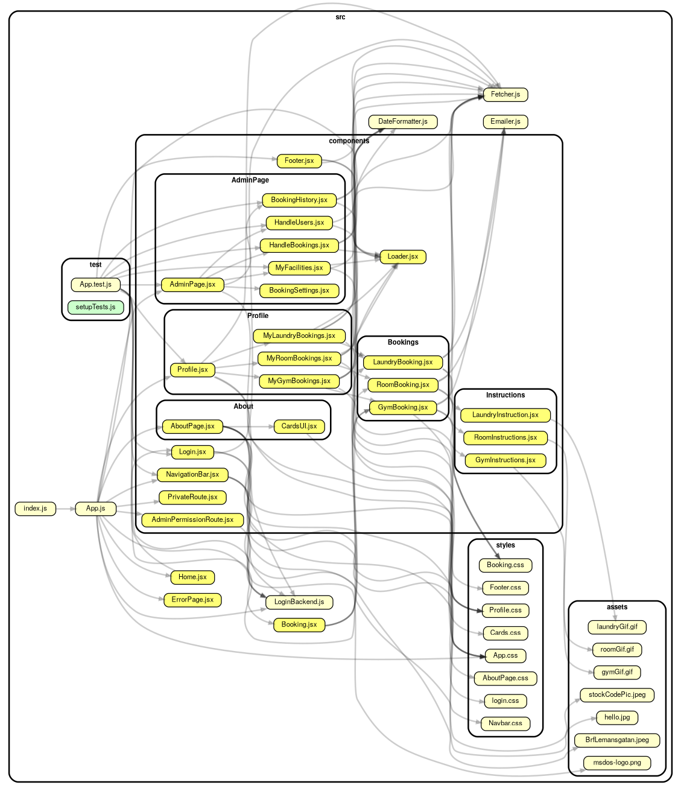

[](https://travis-ci.com/0x3D/MSDOS)
# MSDOS 
Project in DAT257 Agile software project management

## Starta applicationen
___

First of all you need to install node on your system. You can do that by
visit [Nodes website linked here](https://nodejs.org/en/ "Google's Homepage") and download the
__*LTS*__ version and follow the instructions on the website. Or you can check the video further down here in the readmefile.

---
#### Have trouble installing node on your computer? Then we want you to watch this video where they wil show you how to install it!

[](http://www.youtube.com/watch?v=AuCuHvgOeBY)

___


#### Check that you have node b typing:

```
node -version
```

and

```
npm -version
```
___

### When you have node installed

Its now time to clone the repository, and you do that by open a termnal and cd to a folder or location
were you want to save this applikation. When you have found a plave then you will enter the command below in the terminal:

```
git clone https://github.com/0x3D/MSDOS.git
```

__Now__ make sure you are in the __MSDOS__ directory. Do that by open a terminal and cd to were you cloned the repository adn type in:

```
cd MSDOS
```
You can now run the command below to be able to start the project

```
npm install
```
This will take a while first time starting the project. So in the mean time you can open an other
terminal and type in:


When everythin is installed correctly without any error messeges, you can now in the first termonal
where you are in the __MSDOS__ directory typ:

```
npm start
```

This will open your default browser with the react application.


After this you need to start the server.You can do this by going to the terminal and typing:

```
npm run json-server
```

Now the application is started! If you not have the creaters of the application in contact you can
login by typing
```
7
``` 
in the apartment-number login and
```
eusebio.kassulke@gmail.com
``` 
in the password section. 
___
You are now logged in and can use the application!
___


## Documents

We will post links to all the documents with __READ_ONLY ACCSESS__. Please contact us by 
```
msdosmsdos1@gmail.com
```
if there are any problem accessing the links:

## List of the links to the documents

* #### Link to our travis
    * [Travis](https://travis-ci.com/0x3D/MSDOS)
* #### Link to our SSD 
   * [SDD](https://docs.google.com/document/d/10WxI5iAu8TZO15gvbfwLmruxEjfIJko6ZJvROlkM9V4/)
* #### Link to our trelloboard
    * [Trelloboard](https://trello.com/b/5AVDNXZy/ms-dos) 
* #### Link to our KPI:s
    * [KPI:S](https://docs.google.com/spreadsheets/d/19sw7GOvUq1my6g6EroXL_tPxFDV5BKMC786YRKnv_QI/edit?usp=sharing) 
* #### Link to our Project Scope
    * [Project Scope](https://docs.google.com/document/d/1fYLQ0xAVWN6-cZu1c0_JtMYRXMgMFCtFC16pzz4NYeY/edit?usp=sharing) 
* #### Link to our Long term plan
    * [Long Term Plan](https://docs.google.com/spreadsheets/d/1x53tBOJ7qwUyOwf7VgZEqy5vlHOlxTxEDlBvMf7hbvg/edit?usp=sharing) 
* #### Link to our System requirements
    * [System requirments](https://docs.google.com/document/d/1EbG7kYNtikYl7S3jrPMdUNKbx4WJ4uxaDX2bVJyrBMA/edit?usp=sharing ) 
* #### Link to our Team Reflections
    * [TeamReflektions](https://drive.google.com/drive/folders/1f-5Oz8pCtOLcliA5kxH_a1jNeqC-kHbm?usp=sharing) 


___

## DependencyGraph


