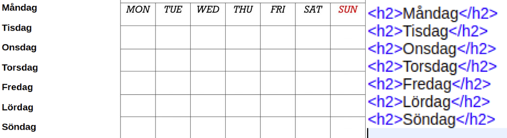

<h2> Individuell reflektion vecka 2 </h2>

___

<h3> Namn: Axel Hertzberg </h3>
<h3> Program: Informationsteknik </h3>

___

## Vad jag vill lära mig och förstå bättre
Från förra veckan när jag sa att lära om vad agilt arbetssätt egentligen är tycker jag att jag har fått lite bättre förståelse kring.

Eftersom vi bestämt att vi ska göra en applikation som har ett grafiskt gränssnitt kommer vi att behöva använda oss av __CSS__.
Min tidigare erfarenhet av CSS är inte stor, har bara en ungefärlig bild hur man använder det. Vad jag vill förstå bättre är vad man kan åstadkomma med CSS och såklart hur.
Exempel hur man kan få veckodagar som att se ut mer som en vecko-kalender genom att bara använda CSS. 
Exempel på bild nedanför där jag vill slutresultatet ska vara likt mittendelen.
___

Hur jag ska lära mig och förstå detta är genom att kolla youtubeklipp om CSS
samt försöka kolla på [w3schools](https://www.w3schools.com/) som visar bra hur man gör.

## Hur jag kan hjälpa någon eller hela gruppen lära sig något nytt. 
Att ta med från förra veckan var att visade jag de gruppmedlemmar om hur vi ska använda git.

Där vi gör vår prototyp av hur designen ska se ut av applikationen kommer vi följa en
del __Designmönster__. Viktigt är att identifiera dem så att man gör dem på rätt
sätt. Hur jag ska göra så gruppen eller någon i guppen ska lära sig något nytt
är att tala om i vår visuella representation vilka/vilket designmönster som
är på respektive ställe. Detta kan jag uppnå genom att lägga kommentarer i __Figma__
med namnet på designmönstret samt i kommentaren länka till en hemsida om
information om just det designmöstret. Självklart också under tillfälle när vi jobbar inne i Figma informera om de designmönstrerna vi stöter på.

## Mitt bidrag till gruppens arbete av Scrum
Från förra veckan tycker jag att jag har fått lite mer koll om vad som ska vara med på en sprintplanering. Men mer kunskap behövs inom detta.

__Scrumboard__ gicks igenom föreläsningen 31/3 där ni visade att man kan använda
__Trello__. Mitt bidrag till gruppen är att sätta upp en Trello, samt
sätta upp de listor vi vet om vi ska ha. Ska även tillsammans sätta upp
"regler" för vilka färgkoder vi använder när saker är avslutade, startade, ej påbörjat etc. 

## Mitt bidrag till gruppens leverans.

Eftersom vi ska använda en form av ett grafisk gränssnitt i vår application ska
vi göra en visuell representation av designen innan i ett program som heter
__Figma__. Figma har jag använt i tidigare kurs så jag kan bidra med till
gruppens leverens är att starta upp ett Figmaprojekt samt sätta upp s.k. frames
och komponenter så det blir lätt att fortsätta bygga på det.
